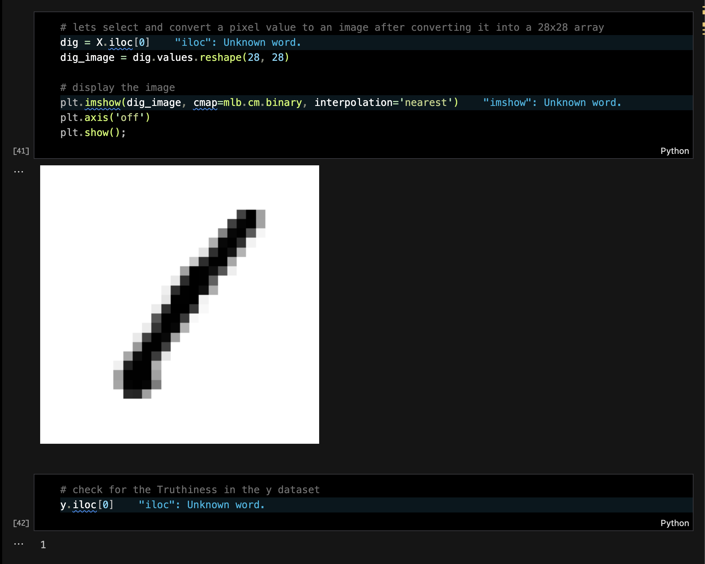

# 1️⃣ Digit Recognizer

A machine learning project that classifies handwritten digits using various algorithms. This project involves comprehensive data preprocessing, visualization, and model optimization to achieve accurate predictions.

---

## 📸 Screenshots

---

## ✨ Features

- Data Wrangling: Cleaning and preprocessing datasets using Pandas, NumPy, and Missingno.
- Data Visualization: Visual analysis of data distribution and patterns with Matplotlib and Seaborn.
- Machine Learning Models: Implemented Logistic Regression, K-Nearest Neighbors, and Support Vector - - Classifier for digit classification.
- Model Evaluation: Assessed model performance using cross-validation.
- Hyperparameter Tuning: Applied GridSearchCV to fine-tune model parameters for optimal accuracy.

---

## ⚙️ Tech Stack

- Pandas, NumPy, Missingno: For data preprocessing and cleaning.
- Matplotlib, Seaborn: For creating insightful visualizations.
- Scikit-learn: For model training, evaluation, and optimization.
